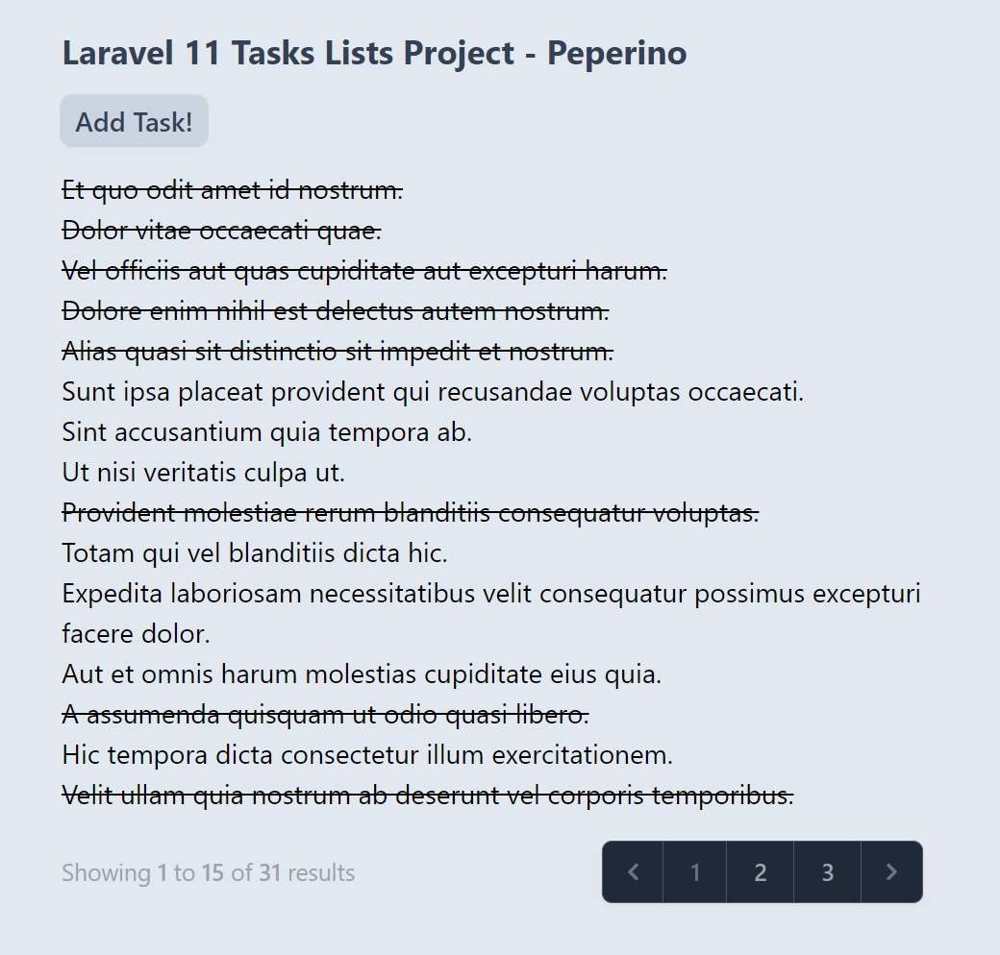
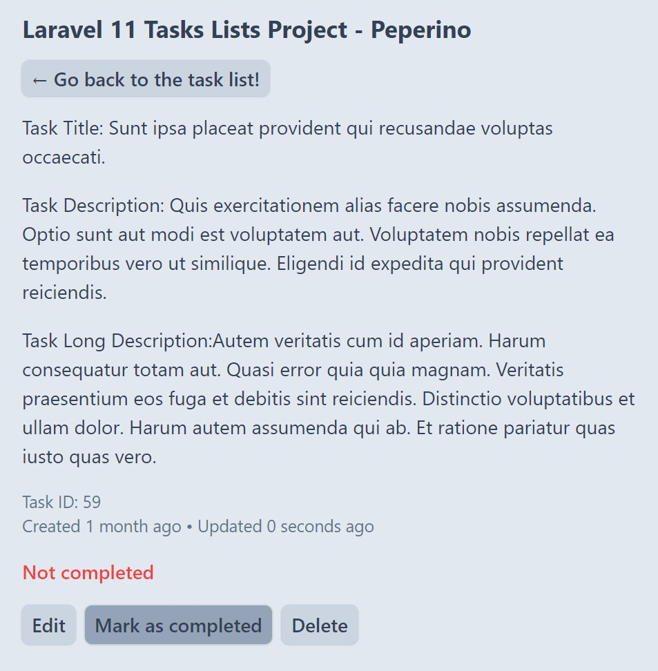
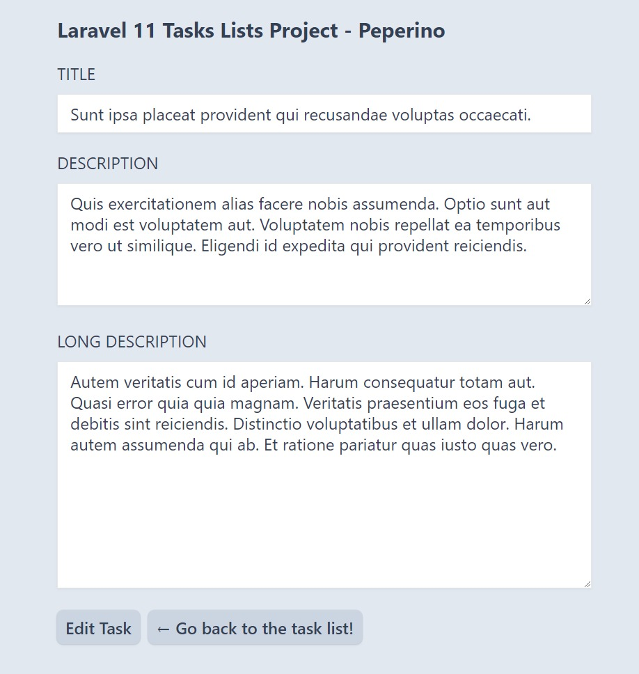

# Pablo Paez 💻 LARAVEL - TASK LIST

 

  

# El proyecto😎

  

El proyecto es parte del portfolio de proyectos de LARAVEL, en esto caso una aplicacion de Tast Lists donde se llevara un registro de las actividades por hacer, las ya hechas, y creacion y eliminacion de las mismas

### Tecnologias utilizadas:

Este proyecto utiliza como herramienta principal: 
PHP - LARAVEL / SQL - DOCKER DESKTOP

Ademas de LARAVEL, se utilizaron conocimientos en:

    -TAILWIND
    -JAVASCRIPT
    -GIT KRAKEN
    -VERCEL HOSTING
    -BLADE TEMPLATES
    -SEEDING A DATABASE
    -USER SESIONS
    -PAGINATION

<!-- LINKS -->
### Contacto📩

Pablo Paez - Desarrollador Web - pablopaez2307@gmail.com

[![LinkedIn][linkedin-shield]][linkedin-url]

[linkedin-shield]: https://img.shields.io/badge/-LinkedIn-black.svg?style=for-the-badge&logo=linkedin&colorB=555
[linkedin-url]: https://www.linkedin.com/in/pablo-paez-t/
